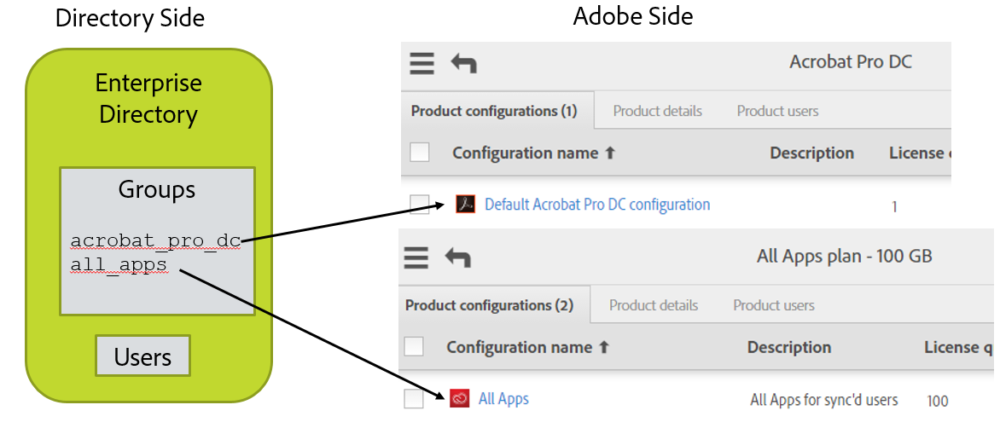

## Layout your Adobe products, PLCs, and user groups

[Previous Section](layout_orgs.md) | [Back to Contents](Contents.md) |  [Next Section](decide_deletion_policy.md)

Product License Configurations (PLCs) are group-like structures in the Adobe user management system.  Each PLC is associated with a product you have purchased.  Users added to a PLC are granted access to and get a license to use the corresponding product.  (The user does not receive anything in this process other than an optional notification that access has been granted.  All license management is handled by back-end systems).

You create PLCs with custom options that control how users will use Adobe products.

You can add users directly to PLCs to grant them access to products.  This is the most common way Adobe product licenses are managed.

Adobe User groups can be used to group users in a logical way that matches your understanding of how they are organized.  Their use is optional, however.  User groups can then be added to PLCs to grant licenses to users.

User groups and PLCs can only be managed by one user sync instance.  If there are multiple directories or distributed departments feeding user information to Adobe via user sync, each must be matched to a single group or PLC.  Otherwise, user sync cannot distinguish between users who should be removed and users who were added by another instance of user sync.

You can use user sync to manage PLC membership and license allocation.  This is optional however.  You can also do this management manually on the Adobe Admin Console or using another application.

User Sync helps you manage Adobe product licenses by allowing you to place users into directory groups using the directory system interface or other tools.  Those groups and then mapped to Adobe user groups or PLCs.  The mapping is part of the user sync configuration file.  When user sync detects that directory users are in one of these mapped groups, the user is added to the corresponding Adobe user group or PLC.  Similarly, users in the user group or PLC but not in the corresponding directory group are removed from the user group or PLC.

&#9744; Decide if you will manage license allocation using user sync.  If not, you can skip the remaining steps for now, but you will still need to do them and manually add users to the user groups or PLCs later. 

&#9744; Create the PLCs in the Adobe Admin console for the configurations of products and groups of users you will be managing.

&#9744; If you are going to use User Groups, create them and add them to the PLC(s) representing product licenses to be issued to members of the user group.

&#9744; Draw a diagram of your Adobe orgs, and the products and PLCs in each.  Add the directory and directory groups to the picture and show the mapping.  For example:

[Previous Section](layout_orgs.md) | [Back to Contents](Contents.md) |  [Next Section](decide_deletion_policy.md)

