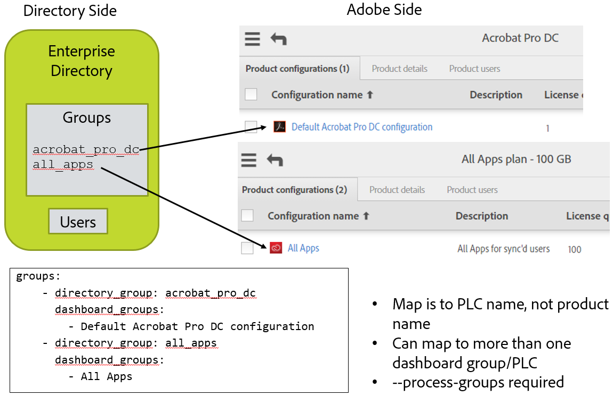

## Setup Configuration Files

[Previous Section](install_sync.md) | [Back to Contents](Contents.md) |  [Next Section](test_run.md)

Now comes the step where we put everything together.  You’ll need:

- Adobe.io integration access values from the adobe.io console
- Private key file
- Directory system access credentials and information about how users are organized
- Decision of whether you are managing product access via user sync
  - Product License Configuration names and user group names for how you want licenses organized on the Adobe side

Let’s setup the configuration files in the next few slides

If you are not managing licenses via user-sync, you can skip the group mapping parts.

Rename “config files - basic/3 connector-ldap.yml” to connector-ldap.yml, then edit.

Put in username, password, host, and base_dn values

Read through the rest of the file to see what else could be specified which might apply in your installation.  Usually, nothing else is required.

Be sure to use a text editor, not a word processing editor.

Be sure to use spaces, not tabs in .yml files.

If you need a non-default LDAP query to select the desired set of users, it is setup in this file as part of the all_users_filter config parameter

If you are driving user sync file a file, you can skip this step.  Setup a csv file with your entire user list following the example.users-file.csv file example.

### Adobe UMAPI Credentials  ###

Rename “config files - basic/2 dashboard-config.yml” to dashboard-config.yml, and then edit

Place the private key file in the user-sync folder along with the other config files.  priv_key_path is then set to the name of this file.

### Main User Sync config file ###

Rename “config files - basic/1 user-sync-config.yml” to “user-sync-config.yml

	dashboard:
	  owning: dashboard-config.yml
	directory:
	  default_country_code: US
	  connectors:
	     ldap: connector-ldap.yml
	  groups:
	    - directory_group: acrobat_pro_dc
	      dashboard_groups: 
	        - Default Acrobat Pro DC configuration
	    - directory_group: all_apps
	      dashboard_groups:
	        - All Apps
	  user_identity_type: enterpriseID
	logging:
	  log_to_file: True
	  file_log_directory: logs
	  file_log_level: info
	# limits and user_removal discussed later

### Group Map

Some customers want to provision user accounts by adding them to an enterprise directory group using LDAP/AD tools rather than the Adobe Admin Console.

To support this, the config file defines a mapping from directory groups to Adobe PLCs.

If a user is a member of a directory group, user-sync will add them to the corresponding PLC.

Same for removal.

### Delete Limits 

Prevention for accidental account deletion

	limits:
	    max_deletions_per_run: 10   # ceiling on disable/remove/delete
	    max_missing_users: 200      # abort if this many directory users disappear

These config file entries are to prevent runaway deletion in case of misconfiguration or other problems.

Raise these values if you will routinely delete more than 10 users per run, or if the size of the directory routinely fluctuates by more than 200 users.

### Delete Protection*

If you want to drive account creation and removal through User Sync, and want to manually create a few accounts then you may need this feature to keep User Sync from deleting your manually created accounts

	user_removal:
	    - exclude_group: special_users   
	    - exclude:   ".*@example.com"   
	    - exclude_adobe_id              

These are optional items in the main configuration file
- exclude_group: names a user group.  Any users in this group are not removed
- exclude: a user name or pattern.  Any matching users are not removed
- exclude_adobe_id:  this causes any account of type AdobeId to not be removed
- These apply to the disable/removal/or deletion of accounts by User Sync
- Note that Federated accounts that are not in the directory cannot log in anyway (because login is handled by the ID provider where the user is no longer listed)

\*  Future feature

[Previous Section](install_sync.md) | [Back to Contents](Contents.md) |  [Next Section](test_run.md)
